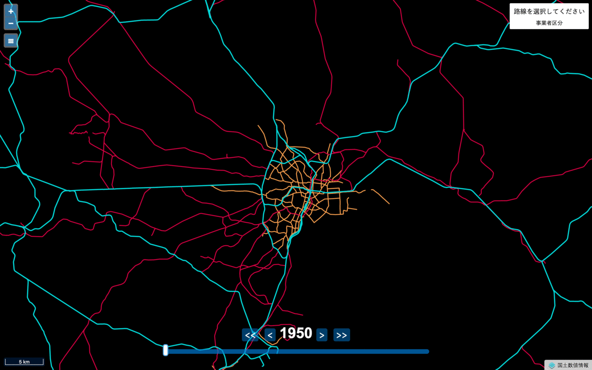

# 日本鉄道時系列地図

日本鉄道時系列地図は1950年から現在までに存在した日本全国の鉄道路線を表示した地図です。国土交通省が提供する地図データ（国土数値情報・鉄道時系列）をバイナリベクトルタイルに変換し、表示した地図です。

### 使用データ

[国土数値情報（鉄道時系列）](http://nlftp.mlit.go.jp/ksj/gml/datalist/KsjTmplt-N05-v1_3.html) （2017年8月8日入手）をMVT方式に変換したもの

- URL: https://cieloazul310.github.io/railroad-timeline-map/
- Powered by OpenLayers v4.3.1
- 作成者: cieloazul310

### UPDATES

- 2017/08/25 v0.1仮公開
